# Advanced Machine Learning: Visualizing the Black Box (CNN)


#### PPT: [https://prezi.com/view/aLMlzVDt2iJCiDe1n1hn/](https://prezi.com/view/aLMlzVDt2iJCiDe1n1hn/)

Term: Fall 2018

+ Projec title: Convolutional Neural Network Feature Visualization
+ Team members
	+ Dong, Jiayi jd3416@columbia.edu
	+ Li, Shilin sl4261@columbia.edu
	+ Lin, Hengyang hl3116@columbia.edu
	+ Zhu, Wenting wz2401@columbia.edu
	
## Project summary:

We choose this project because neural networks as black box function approximators, most people are not sure how each layers are doing their jobs. Therefore, We want to explore what and how exactly different layers are extracting features. In this way, we will have a better understanding of different layers in CNN.

The project has 3 parts. The 1st part we build a straightforward 3-layer CNN and train the model by using mnist dataset. We then visualize the input image which could activate a particular unit from the final dense layer. Then we build a more complicated CNN for training cats_dogs dataset. By controling parameters, we visualize the optimized input image that activate filters for each layer, and compare the result. Also, we used the well-known VGG16 model to visualize the optimized input image and compare each layers learning characterisitcs. The 2nd part we are focusing on how a CNN learns a cat. Using the same model we have for cats_dogs dataset, we feed the network a cat picture and visualize what features the filter receives in each layer. This is another way we understand how CNN is doing classifications. The third part is an additional CNN extension of saliency maps, which are used to observe the important part of an imput picture that the CNN makes classification decision on. The model we use is ResNet50 with Grad-CAM method.

**MNIST Feature**

We created a basic 2-layers CNN for MNIST dataset, and visualized the output before the last dense layer which activate the unit in the dense layer. We can observe different inputs which activates different neurons so that the CNN classifies them to each category. We notice that each filter has learned differently to optimally activate the dense layer unit. All the optimized input images does not come from the training set, but a synthesized optical result which fully activate the dense unit.

network perception 1 | network perception 2 | network perception 3 | network perception 4                               
:-------------------:|:--------------------:|:--------------------:|:--------------------:|
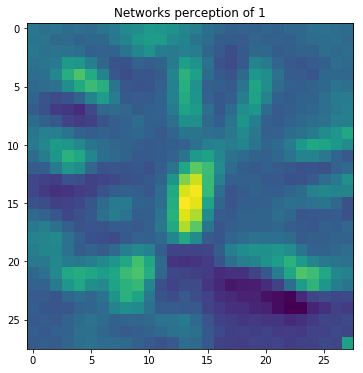|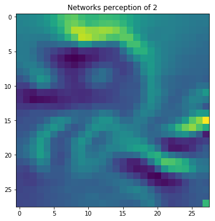|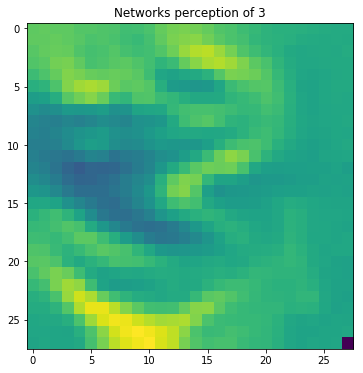|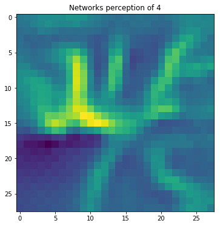|
network perception 5 | network perception 6 | network perception 7 | network perception 8                               
:-------------------:|:--------------------:|:--------------------:|:--------------------:
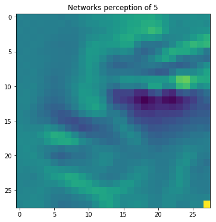|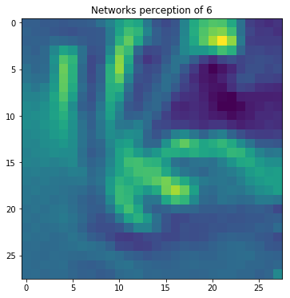|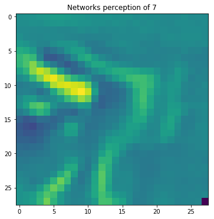|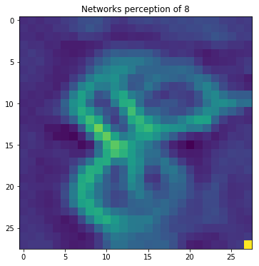|


**Filters Visualization from VGG16**

These filter visualizations tell us a lot about how convnet layers see the world: each layer in a convnet simply learns a collection of filters such that their inputs can be expressed as a combination of the filters. This is similar to how the Fourier transform decomposes signals onto a bank of cosine functions. The filters in these convnet filter banks get increasingly complex and refined as we go higher-up in the model:

* The filters from the first layer in the model (block1_conv1) encode simple directional edges and colors (or colored edges in some cases).
* The filters from block2_conv1 encode simple textures made from combinations of edges and colors.
* The filters in higher-up layers start resembling textures found in natural images: feathers, eyes, leaves, etc.

First Layer             |  Second Layer
:-------------------------:|:-------------------------:
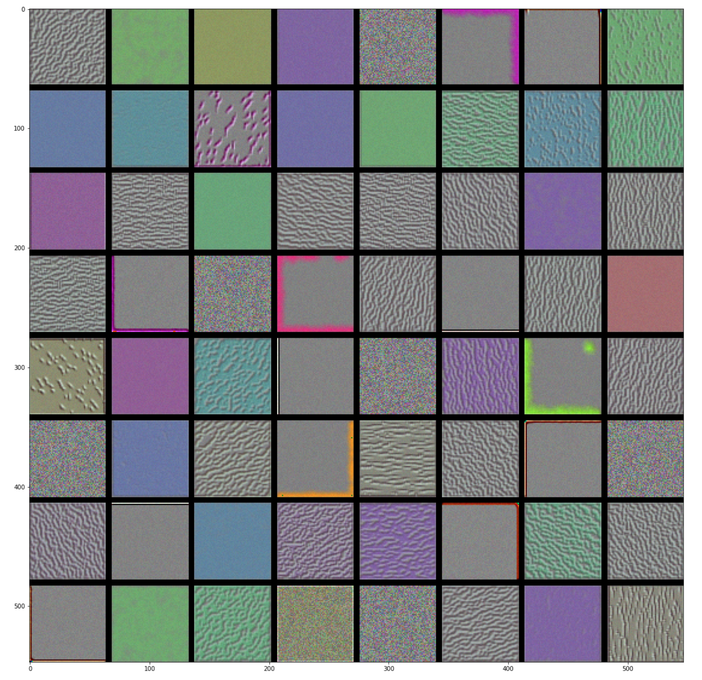  |  
Third Layer             |  Forth Layer
  | 


Our findings:
+ Shadow layers extract the texture and details characteristics.
+ Deeper layers extract the outline, shape and strongest features.
+ Shadow layers includes more features and also has the ability to extract the key features.
+ Comparably, the deeper the layer, the more representative of the features extracted.
+ Resolution of images decrease as the layers go deeper.


**Learning a Cat**

* The first layer acts as a collection of various edge detectors. At that stage, the activations are still retaining almost all of the information present in the initial picture.
* As we go higher-up, the activations become increasingly abstract and less visually interpretable. They start encoding higher-level concepts such as "cat ear" or "cat eye". Higher-up presentations carry increasingly less information about the visual contents of the image, and increasingly more information related to the class of the image.
* The sparsity of the activations is increasing with the depth of the layer: in the first layer, all filters are activated by the input image, but in the following layers more and more filters are blank. This means that the pattern encoded by the filter isn't found in the input image.

We evidence a very important universal characteristic of the representations learned by deep neural networks: the features extracted by a layer get increasingly abstract with the depth of the layer. The activations of layers higher-up carry less and less information about the specific input being seen, and more and more information about the target (in our case, the class of the image: cat or dog). A deep neural network effectively acts as an information distillation pipeline, with raw data going in (in our case, RBG pictures), and getting repeatedly transformed so that irrelevant information gets filtered out (e.g. the specific visual appearance of the image) while useful information get magnified and refined (e.g. the class of the image).

conv2d_5|
:-------------------------:|
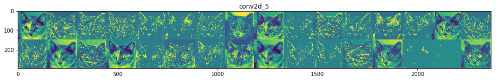|

conv2d_6|
:-------------------------:|
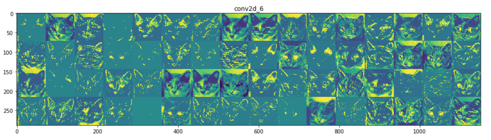|

conv2d_7|
:-------------------------:|
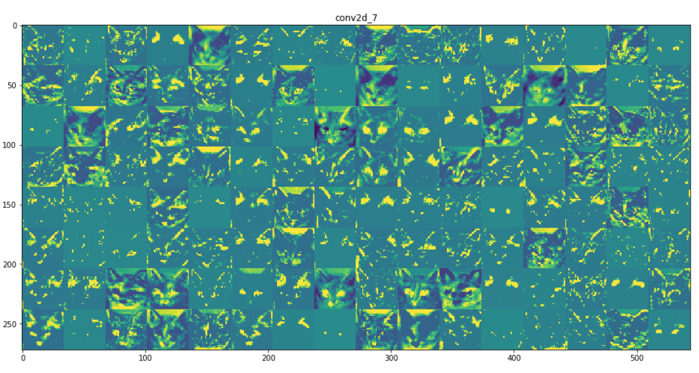|

conv2d_8|
:-------------------------:|
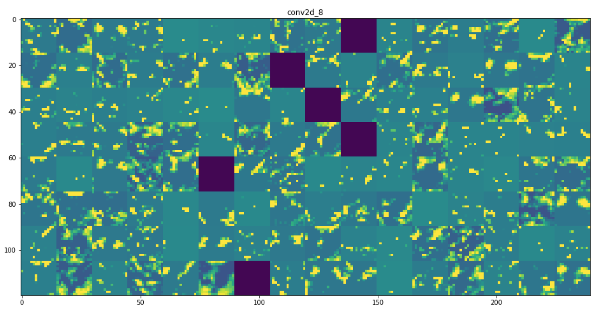|


**Saliency Maps**

In this section, we are reviewing the saliency map for CNN model which is used to make classification decision, referenced in (https://github.com/raghakot/keras-vis/blob/master/examples/resnet/attention.ipynb). To visualize activation over the final dense layer outputs, we need to switch the softmax activation out for linear since gradient of output node will depend on all the other node activations. We want to make the CNN model more transparent by visualizing the regions of input (two ouzels) that are ‘important’ for predictions from these models or visual explanations. The method Grad-CAM is refereced in this paper (https://arxiv.org/pdf/1610.02391v1.pdf).

Ouzel Grad-CAM Saliency            
:-----------------------:
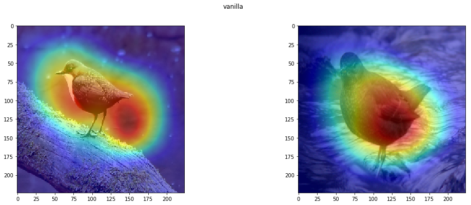|  


## Contribution statement:  

* Dong, Jiayi: Programmed the Mnist CNN model and visulize the mnist dataset on the layer base.
* Li, Shilin: Coded on the cat and dog classification, and write the visualization function to explore the feature extracted from each channel. Summarize the feature differences for the CNN learning process.   
* Lin: Trained the classification model in cats & dogs dataset. Programmed on visualizing each filter from each layer of the VGG 16 model.
* Zhu, Wenting: Coded on the saliency map to explore the contrast area when CNN is doing classification.

All members contributed equally to this project.

Following [suggestions](http://nicercode.github.io/blog/2013-04-05-projects/) by [RICH FITZJOHN](http://nicercode.github.io/about/#Team) (@richfitz). This folder is orgarnized as follows.

```
proj/
├── lib/
├── data/
├── doc/
├── figs/
└── output/
```

Please see each subfolder for a README file.
