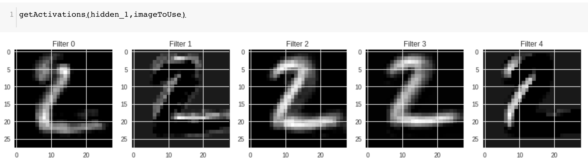
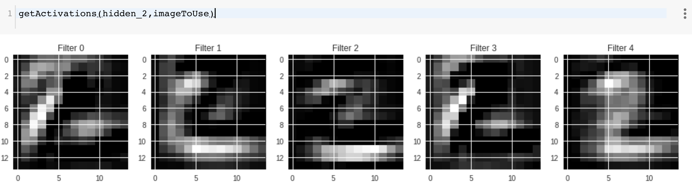
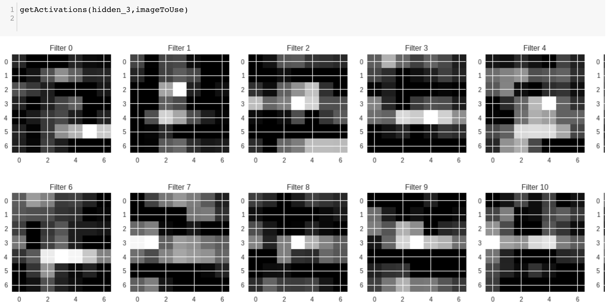

# ADS Project 5: 


Term: Fall 2018

+ Team #4
+ Projec title: Convolutional Neural Network Feature Visualization
+ Team members
	+ Li, Shilin sl4261@columbia.edu
	+ Xu, Zhengyang zx2229@columbia.edu
	+ Yang, Mingyu my2545@columbia.edu
	+ Yu, Chenghao cy2475@columbia.edu
	+ Yue, Yang yy2826@columbia.eduember 2
	
## Project summary:

We choose this project because neural networks as black box function approximators, most people are not sure how each layers are doing their jobs. 

Therefore, We want to explore what and how exactly different layers are extracting features. In this way, we will have a better understanding of different layers in CNN.

1. **MNIST dataset**

We created a basic 3-layers model for MNIST dataset, and visualized each layers' features.

First Layer |
:-------------------------:|
|

Second Layer|
:-------------------------:|
|

Third Layer|
:-------------------------:|
|


2. **ImageNet dataset**

Since MNIST is greay scale images, but we want to explore more about RGB images. Therefore, we used VGG16 as our pre-trained model


3. **Cats vs. Dogs dataset**

First Layer             |  Second Layer
:-------------------------:|:-------------------------:
  |  
Third Layer             |  Forth Layer
  | 

4. **Conclusion**:
	+ Shadow layers extract the texture and details characteristics.
	+ Deeper layers extract the outline, shape and strongest features.
	+ Shadow layers includes more features and also has the ability to extract the key features.
	+ Comparably, the deeper the layer, the more representative of the features extracted.
	+ Resolution of images decrease as the layers go deeper.


## Contribution statement:  

* Li, Shilin:
* Xu, Zhengyang:
* Yang, Mingyu:
* Yu, Chenghao:
* Yue, Yang: 

Following [suggestions](http://nicercode.github.io/blog/2013-04-05-projects/) by [RICH FITZJOHN](http://nicercode.github.io/about/#Team) (@richfitz). This folder is orgarnized as follows.

```
proj/
├── lib/
├── data/
├── doc/
├── figs/
└── output/
```

Please see each subfolder for a README file.
